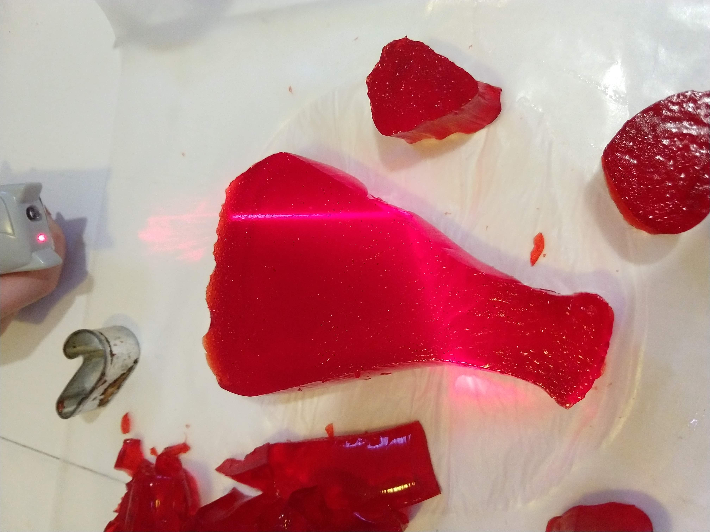

# Lasers and Jello
Not quite Sharks With Lasers.  
However, jello makes an excellent medium that kids can use to design and
create lenses to explore properties of light.

## Objective
Explore properties of lenses and light

## Material
- Jello: 5 packages
- Lasers
- Cookie cutters (optional)
- Bulls eye (optional)
- Disposable table cloth  (optional)

## Difficulty
Easy and safe

## Mess Factor
High.  Disposable table cloth is nice to use since you will get Jello everywhere

## Pointers
Do add a challenge, otherwise this becomes pure play, which is not bad, but if you want them to learn more then a challenge is needed.

* Make the jello thick like Jello jigglers.  The jello needs to be able to stand up on its own.
* Set the jello on a cookie sheet. Easier to cut into lenses
* Make lots of jello.  More than you think you need.  

## Challenge
### Bend light 90 degrees and hit a target

### Bend light 180 degrees and hit a target.
