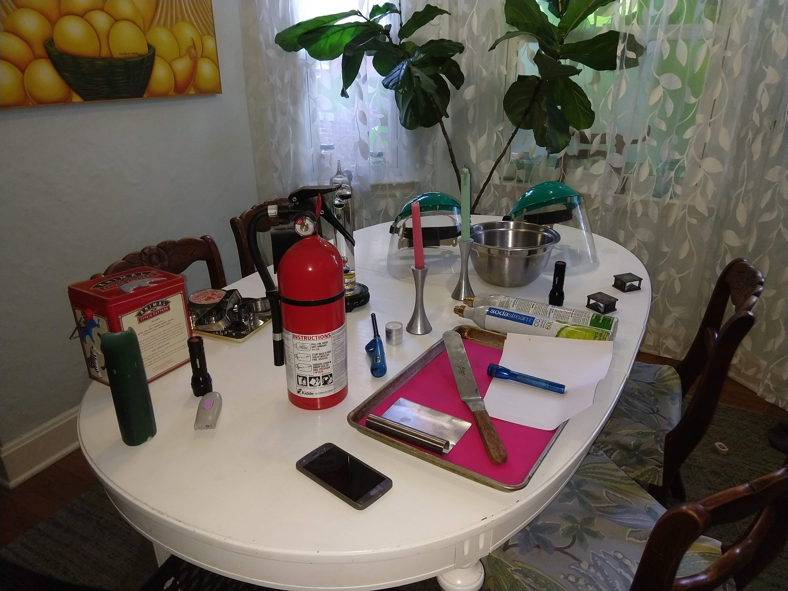

# Science Saturday Mommy Style

## Science Saturday with a Mom.

Backyard science with common household equipment.
Goal is to show that science is:
- [ ] Interesting
- [ ] Does not need expensive equipment
- [ ] Something you can do at home
- [ ] A kid (at heart too) can do alone
    * Adult supervision RECOMMENDED
- [ ] Emphasize that science is all around us and not just something that happens in a lab.  
    * One way to do that, is to use everyday objects to do science.
- [ ] Doable in less than an hour

## Optics / Light Lessons:
* [Laser Jello](./lessons/LaserJello.md)

## Chemistry Lessons:
* [Water Electrolysis](./lessons/WaterElectrolysis.md)
* [Coin Battery](./lessons/CoinBattery.md)
* [Sodium](./lessons/Sodium.md)  
* [Soap Foam](./lessons/SoapFoam.md) aka Elephant Toothpaste or Unicorn Poo

## Physics Lessons:
* [Super Cooled Water](./lessons/CoolWater.md)(soon)
* [Plasma with Grapes](./lessons/PlasmaGrape.md)
* **Density**
    * [Aluminum Boats: Make metal float](./lessons/AluminumBoats.md)   
    * [Sink A Marshmallow](./lessons/SinkAMarshmallow.md)
* [Spectroscope: Measure light](./lessons/spectroscope.md)

## Electronics Lessons:
* [Coin Battery](./lessons/CoinBattery.md)

## Food science

* [Make Dry Ice, Ice Cream](./lessons/IceCream.md): Tasty Emulsions!
* Butter (soon)
* Sugar Candy (soon)

## One Hour Fun:
### Chemistry 101
Shows how elements have different physical properties than a molecule made up of those elements.  Then explore how the ratio effect the physical properties of the molecule with H2O and H2O2.
* [Water Electrolysis](./lessons/WaterElectrolysis.md)
* [Soap Foam](./lessons/SoapFoam.md) (Very Messy but fun.)

### Density 101
* [Aluminum Boats: Volume](./lessons/AlBoats.md): Make a metal float!
* [Sink A Marshmallow](./lessons/SinkAMarshmallow.md):

## Stars: Why we look out
We look out to discover more about ourselves and our planet.  
By looking out into the stars we learned how plasma work and discovered
helium 30 years before it was found on earth using a spectroscope.
* [Plasma with Grapes](./lessons/PlasmaGrape.md)
* [Spectroscope: Measure light](./lessons/spectroscope.md)

## ***Disclaimer:***
* Not liable for damages due to use or misuse.
* No warranties expressed or implied.
* For educational purposes only.
* ***Safety goggles may be required during use***.
* Void where prohibited.
* You may experiences fails, have fun and try again.

## Watch on YouTube ONLY
There are cool experiments out there that one should not do at home but they are still pretty cool.  Below are experiments that you should just watch from a safe distance.
* [Glow Water](./lessons/GlowWater.md)
