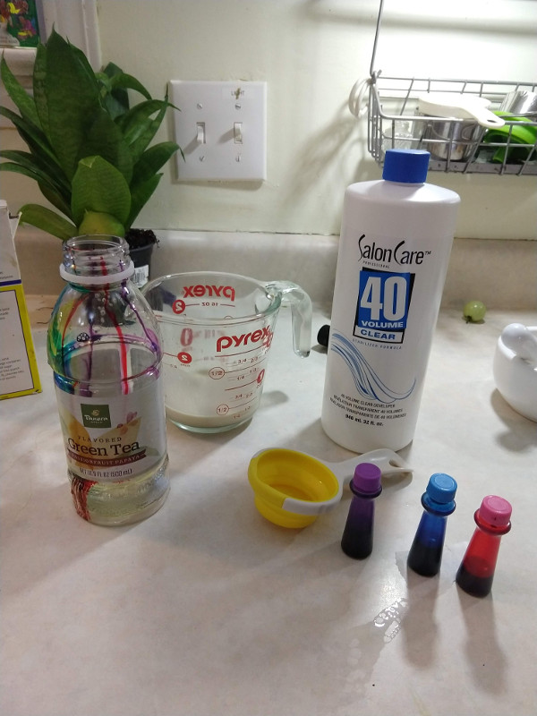
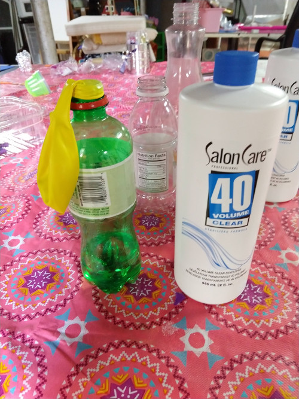
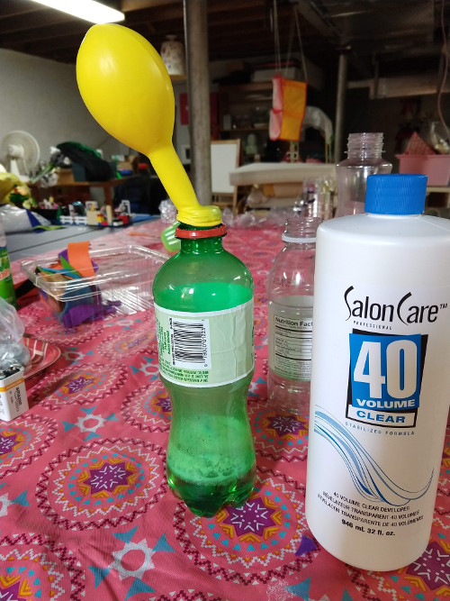
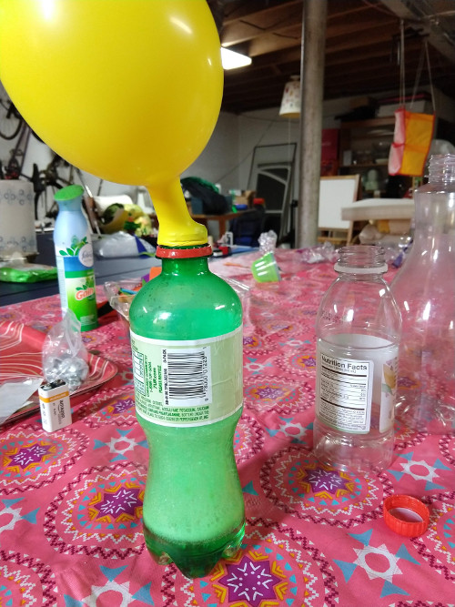

# Soap Foam AKA Elephant Soap

Hydrogen Peroxide (H2O2) when mixed with a yeast (a catalyst) produces Water (H2O), Oxygen (O) and HEAT.
Add soap to capture the Oxygen creates a hot, soapy, mixture.

## Goal
Science is FUN and that you can do it at home!

Also, to show that hydrogen peroxide is much much different than water even though it contains the same exact atom as water.

Different atoms in combined make molecules that can have completely different physics and chemical properties than the atoms it is made out of.

In addition the combination, or ratio of the atoms in a molecule also affect is physics and chemical properties.

## Materials

* Empty soda bottle
* Measuring cup and measuring spoons
* Salon-grade hydrogen peroxide (6-12 percent by volume; 20, 30 or 40 clear developer)
* Concentrated dish soap
* Liquid food coloring four-pack 
* Large tray or newspaper to protect surface from mess
* Funnel (optional)
* Small container
* Active dry yeast
* Long Stem matches (optional)
* Balloon (optional)

## Steps
In a soda bottle mix:
 * 2 cups salon-grade hydrogen peroxide,
 * 1 teaspoon dish soap, 20 drops each green and red liquid food coloring, and 10 drops each yellow and blue food coloring. (Tip: Standard 3 percent by volume peroxide from the drug/grocery store will work too, but with less effect.)

Place the soda bottle in large tray or on protected surface and place funnel in opening of the soda bottle.

In a small container, thoroughly mix
* 2 tablespoons yeast and
* 6 tablespoons warm water. Let sit for 2 minutes.

Pour yeast mixture into funnel or directly into the soda bottle, quickly remove funnel from the bottle, and step back!

### Smaller bottles work too!
If you are using small 16oz water bottle use about 1/2 cup of H2O2.

## Time
30 min

## Lesson
* H2O2 is Hydrogen peroxide &
* H2O is Water

***What a difference One little Oxygen makes***

- Water (H2O) => Safe, stable
- Hydrogen Peroxide (H2O2) => Can be harmful, can cause burns, not stable.

In the [Water Electrolysis](WaterElectrolysis.md) experiment, we saw that water is made up of 2 hydrogen atoms and one oxygen atom.  Both hydrogen and oxygen are gasses but combined they form a liquid!  

If ONE more oxygen atom is added to a water molecule; we get Hydrogen peroxide!  Hydrogen Peroxide is a liquid that looks like water. And, it really really wants to be water.  When it gives up an oxygen atom, an exothermic (e.g. produces HEAT) reaction occurs. Depending on the catalyst, it can give up that Oxygen explosively!  So, lets not experiment too much with catalysts and high percentage of H2O2.

Soap is one way we can capture the oxygen gas!  And Yeast is a safe catalyst.

## Level of effort
Easy

## Clean up: Level of effort
* Mess factor HIGH.  Do outside.

* Pretty Safe: However, Wear safety glasses and gloves.
High strength Hydrogen Peroxide can cause burns.

## Pointers
Show that it is Oxygen that is being produced

(WARNING: ADULTS ONLY)
Do the same experiment with 3% Hydrogen Peroxide and some yeast (NO SOAP).  Then take a match with a very LONG stem and place it in the container.  It will RAPIDLY light up!

## Extra
Soap is not the only way to capture the Oxygen.  You can use a balloon.
Steps:
* Place some dry yeast in a balloon.
* Place 1/2 cup of hydrogen peroxide in a soda bottles
* Place the balloon on the soda bottle
    * Take care not to get the yeast into the bottle
* Tip the yeast into to bottle.

## References
* [Martha Steward Recipe](https://www.marthastewart.com/863046/elephant-toothpaste)
* [Endo ad Exo thermic eperiments](https://www.acs.org/content/dam/acsorg/education/resources/k-8/science-activities/chemicalphysicalchange/chemicalreactions/heat-up-to-some-cool-reactions.pdf)
