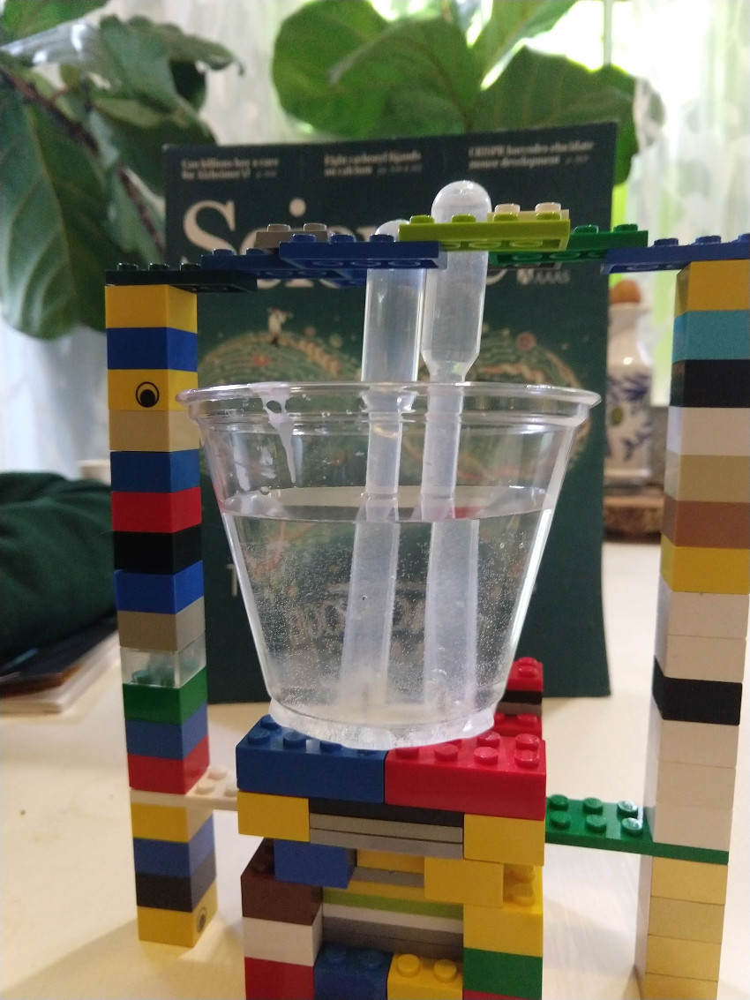

# Water Electrolysis: H2O to 2H and O
 

Electrolysis of water is the decomposition of water into oxygen and hydrogen gas due to the passage of an electric current. The reaction has a standard potential of −1.23 V.

 So if you can supply a potential difference greater than  1.23 volts you can split water!
## Goal
Use simple office supplies and Legos (optional) to separate the hydrogen from the oxygen in water.

## Materials
- [ ] 1 Plastic Cup
- [ ] 2 Thumb tacks
- [ ] 1 Nine Volt Battery
- [ ] 2 Plastic Pipettes or empty water bottles (optional if collecting the gas)

### Optional Materials
- [ ] Legos

## Time
30 minutes with Legos
## Lesson

## Level of effort
Easy

## Clean up: Level of effort
- [ ] Easy
## Pointers

## References
* [Excellent Video](https://www.youtube.com/watch?v=HQ9Fhd7P_HA)

* [Wikipedia: Water Electrolysis](https://en.wikipedia.org/wiki/Electrolysis_of_water)

