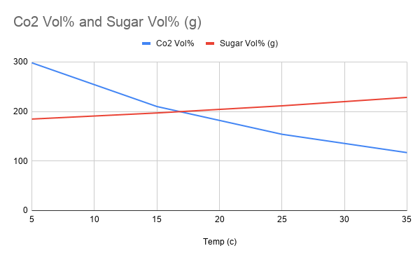
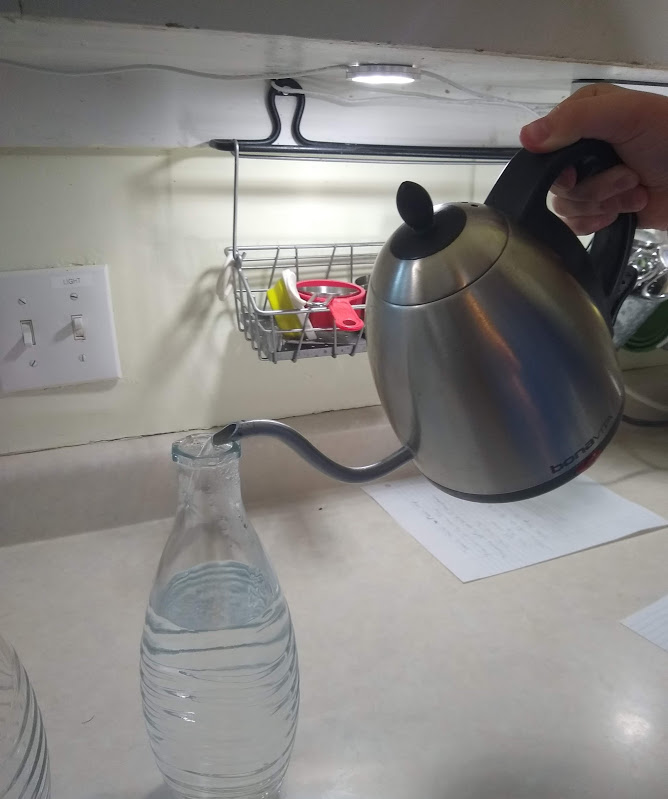

# CO2 Solubility

This experiment, like the sugar solubility, is about the the solubility of things, Instead of solids its gases and how they differ when it comes to solubility.  

## Goal
To learn about the difference in gas and solid solubility.
Make science fun!  This is in contract to solids into liquids, ( [see Sugar Solubility](SugarSolubility.md) )

## Materials

- [ ] Hot and cold water
- [ ] Bottles for a carbonation machine
- [ ] A carbonation machine for water
- [ ] A piece of paper for results

## Time

It took me about 30 minutes to set up, do and clean up this experiment.
Total Time: 30 minutes
Set Up: 5 minutes
Clean Up: 5 minutes

## Lesson

Steps:

1. Gather you materials
2. Put the cold water in the carbonation bottle and carbonate it (5 pumps)
3. Add the hot water to the carbonation bottle and carbonate it.
4. Which one had more Co2 in the water. Example questions: (Which one tasted flat? Which one had more bubbles?)

## Level of effort

Easy

## Clean up: Level of effort

Easy

## Pointers

- You can either pour out the water of drink it!
- Notice how the ***hot water*** has ***larger*** bubbles but the cold has smaller bubbles. However the hot water tastes FLAT.
- For my carbonation machine I used 5 pumps of carbonation with 1 second in between. For repeatability I would recommend the same thing (this will not accent you results, you only need to use the same number of pumps for both the hot and the cold.

## FYI

* This is why warming oceans are releasing CO2 into the atmosphere.

## WARNING

Do not use boiling water since you can burn yourself.  Use very cold and Hot to touch water.

## References

- [Sugar Solubility Data ](https://chestofbooks.com/food/science/Experimental-Cookery/The-Solubility-Of-The-Sugars.html#:~:text=Sucrose%20has%20the%20greatest%20solubility,are%20soluble%20in%201%20cc.)
- [Co2 Solubility Data ](https://www.researchgate.net/figure/Solubility-of-CO2-in-distilled-water-in-ppm-as-a-function-of-temperature-and-the_tbl1_226545649)
