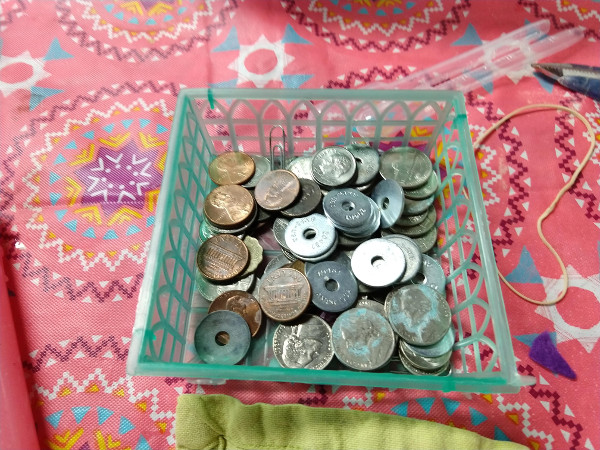
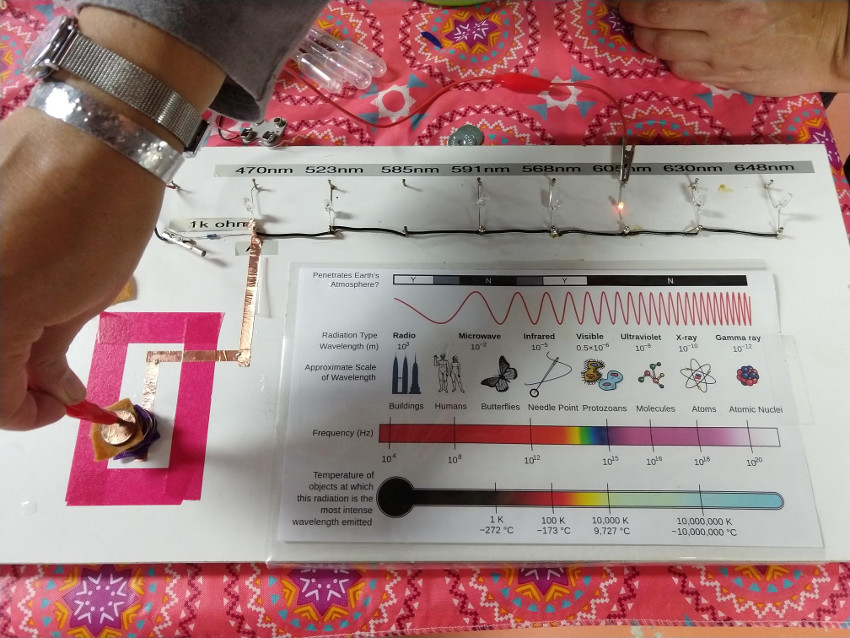
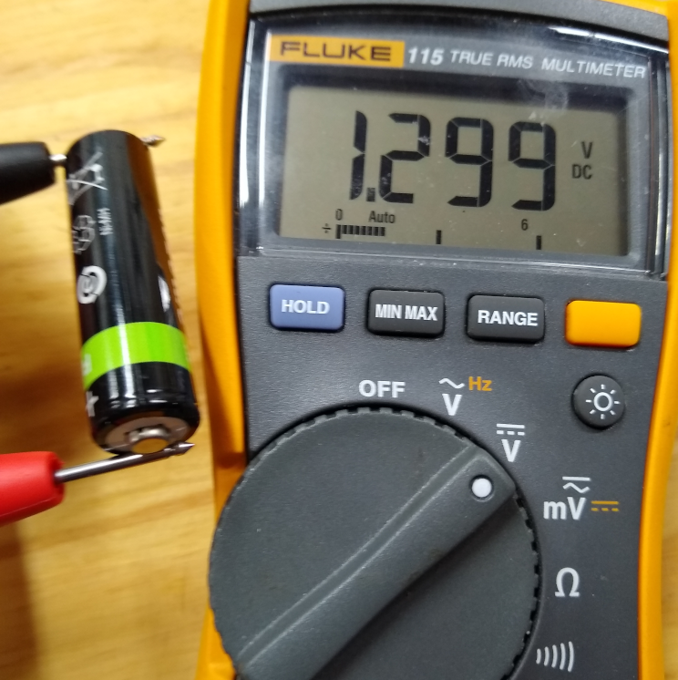
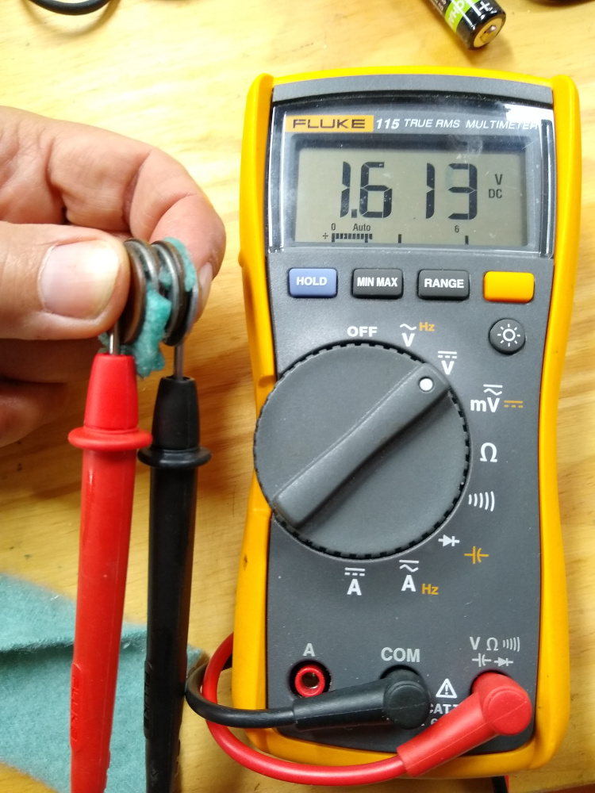
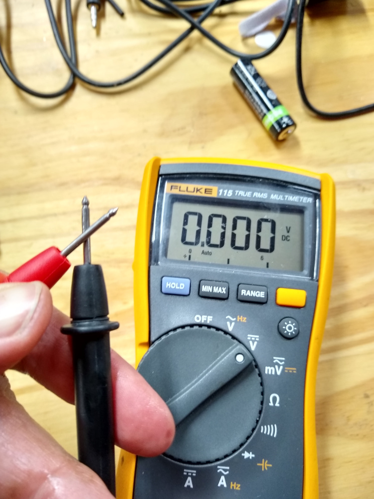

# Coin Battery

We can turn pocket change into a battery that can light up a light!

With the right coins and with care when we connect them together we can build a real battery.

Project supplies are cheap and easy to come by.
Also, if you connect enough coin batteries together you can light an LED!  ***But*** LEDs are diodes, so you have to pay attention to how the current should flow.

Using a voltmeter to show the effect with the coin battery is simpler but less satisfying.  E.g. no ***Let there be LIGHT!*** jokes.

 This is listed as a 5th grade science project, but first graders should be able to do this.

## Goals

  To make science more approachable!
   
  Achieved by using only household goods, to show that science can be done anywhere.
  
  Proving, anyone can do science.

## Materials

For each coin battery station, you’ll need:

- [ ] A small glass or bowl
- [ ] Salt and/or vinegar
- [ ] Spoon or stir stick
- [ ] Thick paper towel, blotter paper, cloth, felt
- [ ] Scissors
- [ ] ~ 6 each, pennies, nickels, dimes, zinc plated washers
     - Example: 6 pennies and 6 washers
- [ ] A voltmeter that can read at least tenths of a volt
- [ ] Small battery, AA or AAA is fine
- [ ] Optional LED

## Time
30 mins

### Preparation

Super Easy!

The only preparation needed for the coin battery project is to gather the materials.

OPTIONAL:
A range of LED diodes at different wavelengths.  Due to the relationship between energy and wavelength, different wavelengths take different amount of energy to light up an LED. The red LED turns on with the the lowest voltage.  This setup allows the students to see the effect of stacking different amounts of batteries in series.

See [Planck Constant](https://en.wikipedia.org/wiki/Planck_constant) for more information on this relationship.

## Lesson

### Battery Test

Use the AA battery as shown in the photo to the left to verify you have the meter set up correctly.

If the light bulb project is being performed at the same time as the coin battery, this is the perfect time to show how the battery can be used to make the flashlight bulb light up.

***Let the Students know that*** If the meter moves using coins and salt water, (e.g. You have a voltage difference) then they just built a ‘real’ battery.  Or they created there own potential (PUN intended!)

### Steps: Building The Battery:

* Add a small amount of water in the glass or bowl. 1/4 cup should do just fine. Mix in enough salt such that a few grains no longer dissolve after stirring.

* Cut about 8 – 10 pieces of the paper towel or soft cloth into sections that are just big enough to cover a nickel but do not hang over the side. To prevent problems, it is best to use the smaller coin, trace it out on the paper and cut the circles out with scissors. When done, place them in the salt water solution so that you can get them back out one at a time.

* Lay out about 6 nickels and place one piece of the salt-water soaked paper on each. Be sure that the paper covers the whole nickel, but don’t let it drape over the side.

* Lay a penny on top of each paper. Be sure the penny touches only the paper or it won’t work well.

***Each of the penny-paper-nickel stacks becomes an individual coin battery cell!***

Your DONE.  You just built not one but multiple BATTERIES.  Congratulations!

### Testing the Battery

| Coin Battery  | Zero Voltage  |
|  ------       |  ------    |
|  |  |

Turn the voltmeter on to a DC Voltage setting that shows at least one, and if possible, two or more decimal points as shown in the photo. Test each coin battery cell to make sure it is working as a small battery by putting one lead on the nickel and the other on the penny. You should see somewhere between .25 and .50 volts DC depending on how well that cell is working.

After each nickel/paper/penny cell is tested, set it on top of the previous cell. For example, after two cells are tested, you should have a nickel, paper, penny then another nickel, paper, penny. After three cells, you will have a nickel, paper, penny (no paper), nickel, paper, penny, (no paper), nickel, paper, penny … and so on. After stacking each new cell, put one of the voltmeter leads on the bottom nickel and the other on the top penny. With each new added cell, you should see a total voltage that is about the same as adding up what you measured for each individual cell that is now in the stack.

#### Battery cells
Table below show the voltage per battery cell.

| Battery Cells |  Volts     |
|  -------      | -------  |
|   1           |  ~ 0.25     |
|   2           |  0.5 - 0.8  |
|   3           |  0.8 - 1.4  |
|  5 - 6         |  1.5 - 2.5  |

### Multi Cell Coin Battery
***Let there be LIGHT***

In the photo above, 1.25 Volts was achieved with 3 cells connected together.

1.4V is usually enough to light an LED.

After about 3 cells, it gets hard to hold them all together without shorting out the battery. It is easier to build the coin stack on the table and use the points the meter leads to touch the bottom and top coins.

***NOTE*** LEDs are diodes so the current only flows in one direction. Also there might not be enough current in your coin battery to light the LED, but give it a try! It’s well worth the effort!

## More Experiments

Try the other coins to see what happens.

 You should see that some coin combinations make better batteries than others.

## IMPORTANT NOTE

Be sure the students see that if the meter leads are held apart, touched together, or even put in the salt water by them self, nothing happens. Two dissimilar metals are needed to act as the battery terminals, and without them, no voltage is generated.

## Troubleshooting

If you have trouble getting good readings, make sure that the paper does not drape over the side so that it touches other coins. That shorts the battery and little or no voltage will be displayed on the meter. If the water isn’t salty enough, it will not act as a good electrolyte. That means only a few ions will move from one coin to the other and you will have low voltage readings. If you put paper between the individual cells (see above for the correct stacking order), poor if any voltage will be generated.

Those are the most common problems, but if all that seems to be ok and the meter still won’t read, try lightly sanding the coin surfaces with a small piece of sand paper. That should fix it.

### Why Does it "Short Out..."
when the salt-water soaked paper is between the individual battery cells?

***OFFICIAL ANSWER***
Doing that connects a zinc-copper battery to a copper-zinc battery.

***In other words***
If you use the wet paper between cells, you will have a (-) zinc terminal connected to a (+) copper terminal, then the same (+) copper terminal is immediately connected to a different (-) nickel terminal when you put the next zinc on the stack.

***In other other words***
Another way to look at it is that as the positive voltage goes one way, but being immediately canceled out by negative voltage going the other way. The net effect is no total voltage.  

By leaving the wet paper (electrolyte) off between each individual battery cell, there is no electrolyte to force copper and zinc(or Nickel e.g. the other coin) ions to flow. Only free charge will flow from one cell to another through the metal-to-metal contact. When more than one battery cell is included, the voltage increase becomes additive, and you see the effect we saw during the experiment.

## What just happened?

We made a battery!

We connected several batteries together in series to get enough voltage to light an LED. One coin became the  (+) terminal of a the battery and the other coin became the  (-) terminal.

### History / Provenance
First performed by Alessandro Volta in something he called a voltaic pile way back in 1800. (The unit volt is named after Volta). He used alternating (copper and zinc) or (silver and zinc) discs that were separated by cardboard or cloth soaked in salt water, just like we did above. Some metals have more free electrons to give up or accept in ionic form than others, some dissimilar metal combinations work better as batteries than others. If you tried different coins above, you should have seen that effect. If you tried two of the same coins together, penny – paper – penny for example, you would also see that coins with the same metal in them will not give you a battery at all.

### Summary

* A simple battery is simply two dissimilar materials: One with loosey goosey electrons that it likes to give up and the other that likes to receive electrons separated by electrolytic solution.
  * A coin battery: one penny, one piece of salt water soaked paper (the solution) and one nickel,
* A coin battery uses the same process that happens in a battery you buy at the store.
* A single coin battery has too small of a voltage to light a bulb on its own.
* If we connect enough of the coin batteries together in the right way, a light bulb can be turned on. This is the same thing that happens in a flashlight, car battery etc.
* Battery Acid is the electrolytic solution that makes the battery work, but much stronger than what we use.

## Clean up:
* Easy
* Level of Effort: Easy

## Reference

Adapted from [How Things Work: Coin Battery Project](https://how-things-work-science-projects.com/coin-battery-project/)
