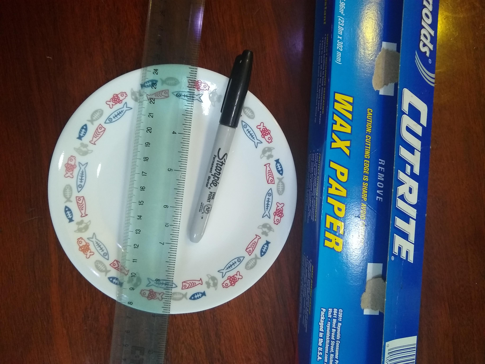
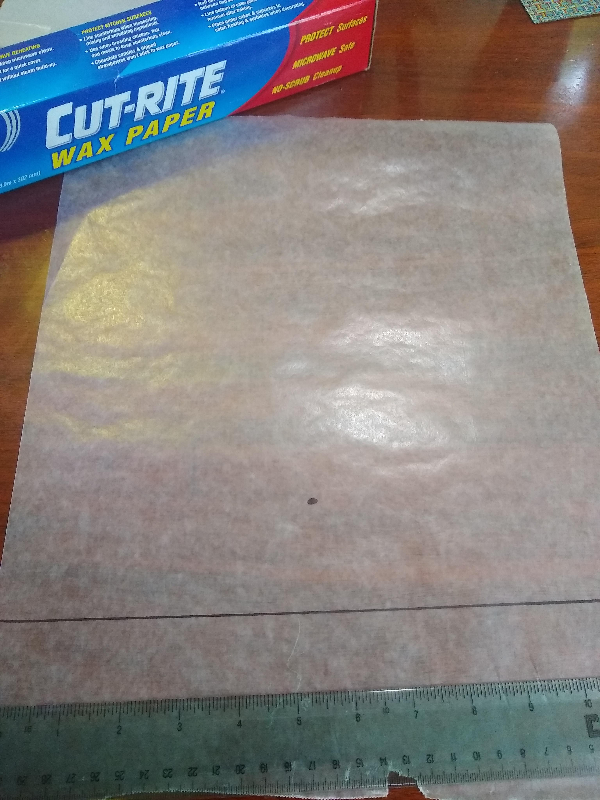
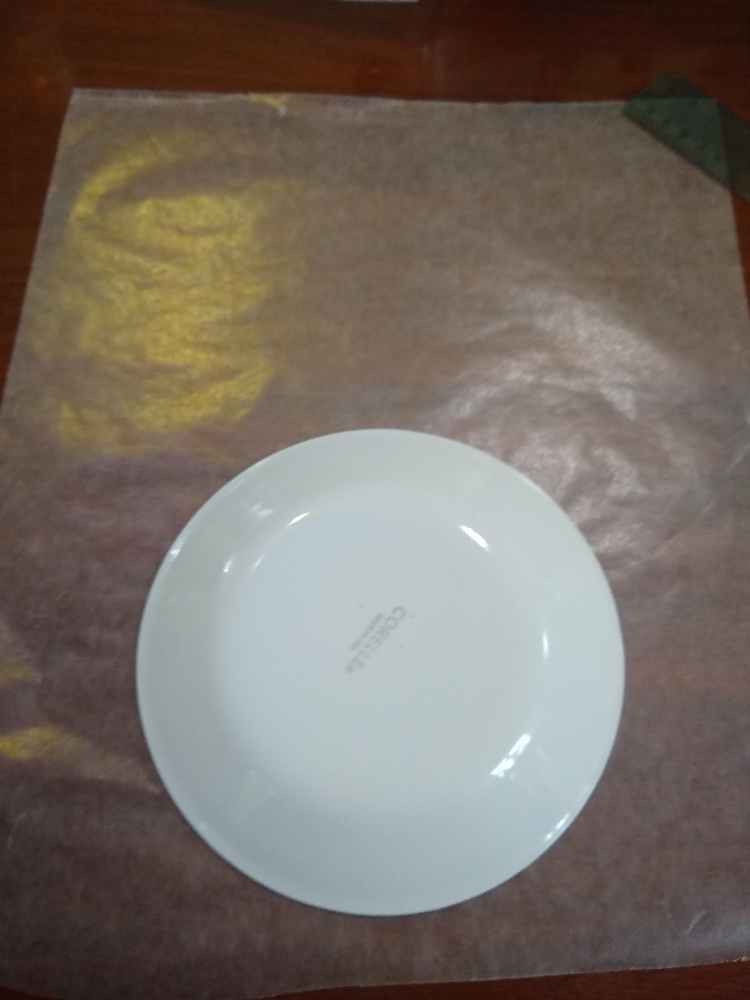
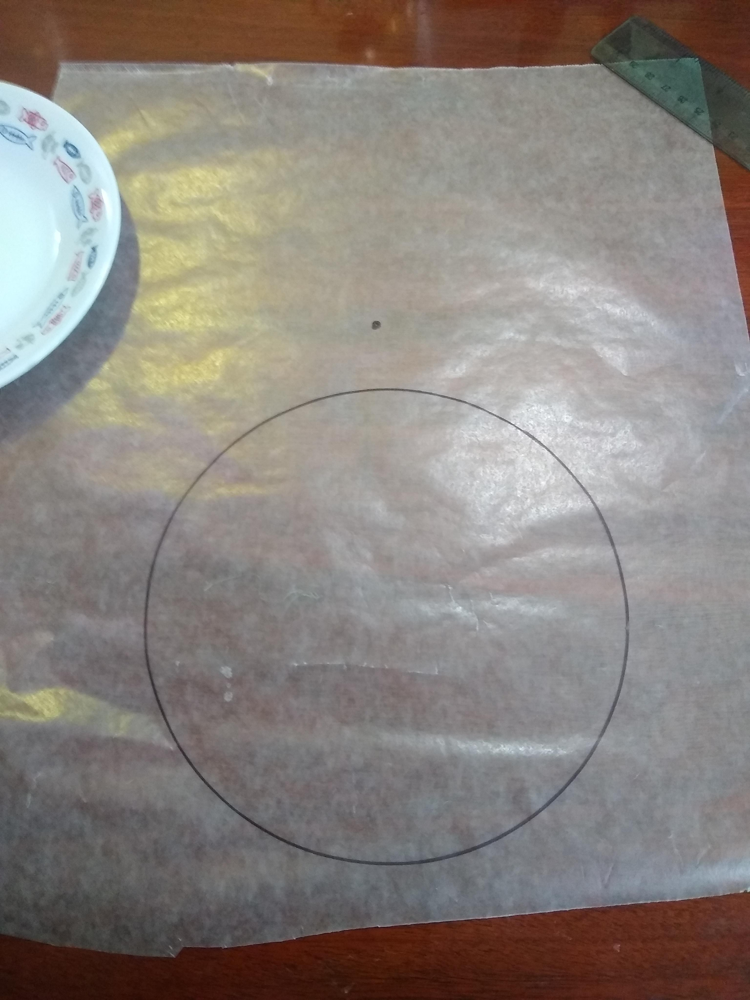
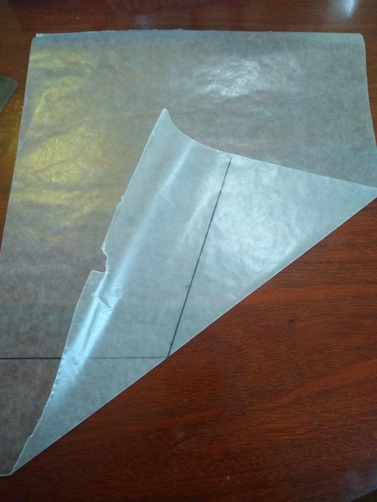
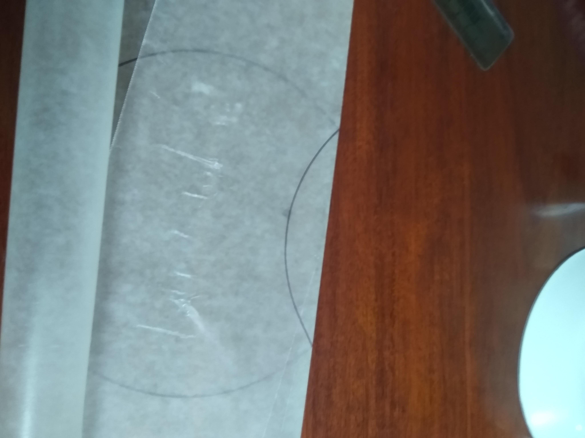
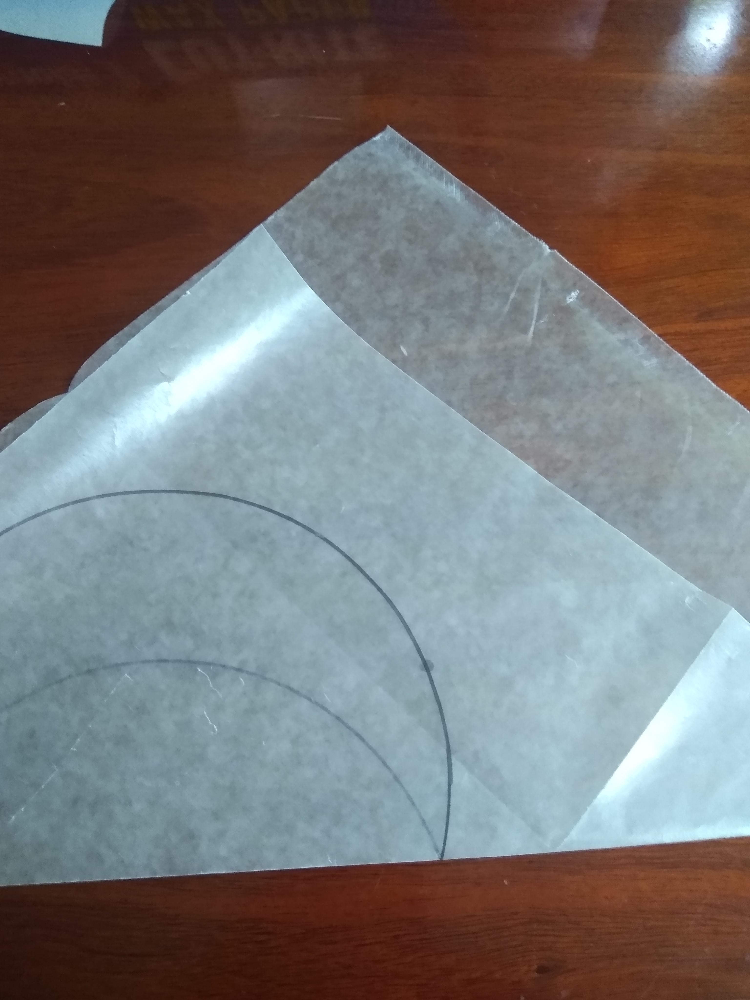
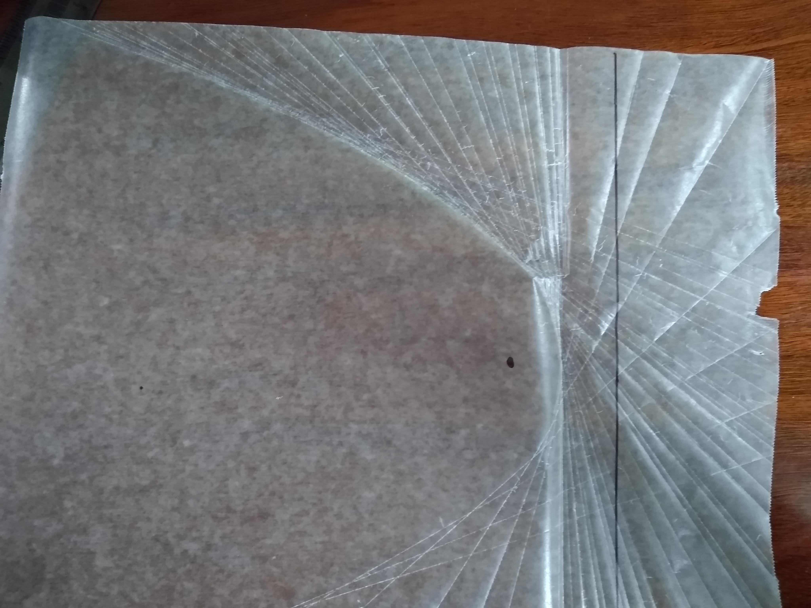
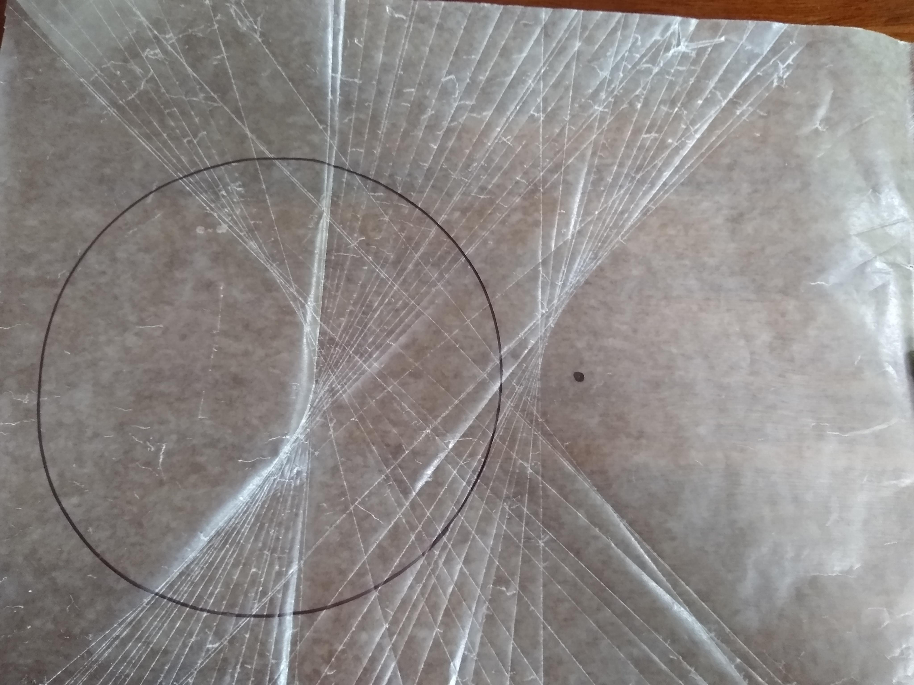
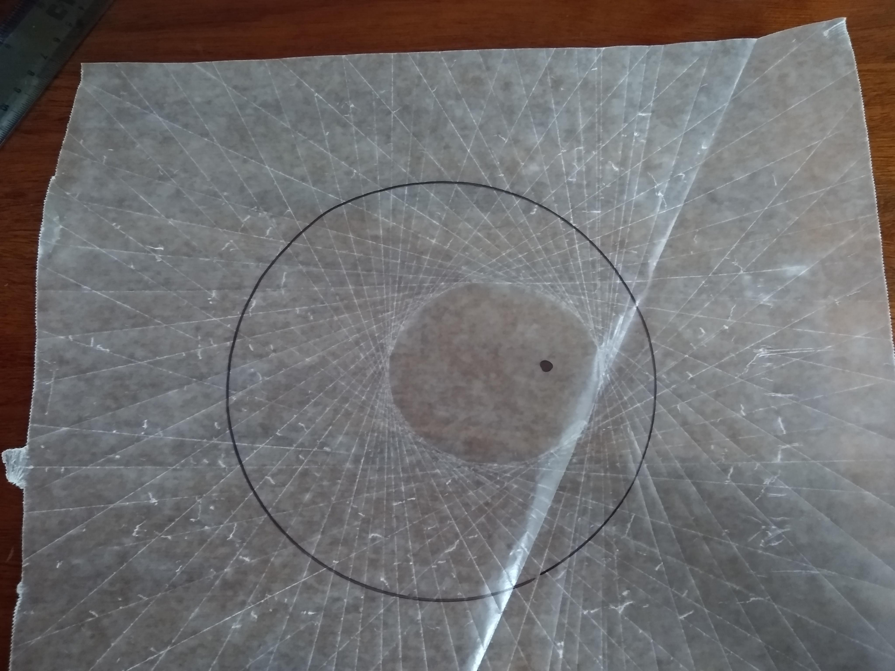

# Conics: Ellipse, parabola, hyperbola
Conics in mathematics and geometry in particular is an import concept 
to understand.  

We can take a cone and slice it to make a circle, 
line, point, ellipse and parabola.  

**But**, can one take a piece of paper and fold it to make a ellipse, 
parabola and hyperbola? **YES**
 
In this lesson, you will fold a piece of wax paper to make these three shapes.  
Proving the equation of parabola?

## Goal
Visualizing how these three shape Ellipse, parabola, hyperbola are:
 * related,
 * how the equation can be visualized
 * how if space is curved how this effects the shape made. 

## Materials

- [ ] Marker
- [ ] 3 large pieces Wax paper
- [ ] Ruler
- [ ] Small Plate

## Time

- 15 min. if just doing the folding.

*  Proof of a parabola Add another 30 - 60 mins 

## Lesson

Playing with 2-D geometry to learn about conics!

### Steps

- Take three large pieces of wax paper.
- One the first piece draw a line and a point.
- One the second piece of wax paper draw a circle and a point outside the circle
- One the last piece draw a circle and a point inside the circle 
- for each paper fold the point onto the line and make a crease into the wax paper.
- Repeat at another point on that line.
- Repeat above about 10-40 times until you see the shape.

| Steps | Line Point | Circle Point | Circle Point |
|:-----: |:-----: |:-----:|:-----:|
| Draw shapes |  |  |  |
| Fold |  |  |  | 
| Repeat Above |  |   |  |

## Level of effort
EASY

## Clean up: Level of effort
EASY

## Pointers

Take care making the creases.  The wax paper is not too forgiving.

## MATH

Parabola is a symmetrical open plane curve formed by the intersection of a cone with a plane parallel to its side.
It is also defined as the locus of all points equal distant from a given  
 **point** (our marker point) and a  
 **line** (our marker line).

When we drew a line and a point and folder the wax paper so that the line touched the marker point, 
we created a single point on the parabola.
We can clearly see that the distance from the parabola point and 
the point on the line is equal to the point on the parabola and the 
marker point.

Now to prove that this is the formal for a parabola. 

### Givens
* the line (PL) from our marker point **P**  and the point on the line (L) is
   * y = mx + b 
   * m = slope is rise over run. 
       * Let marker point P = (0, f) 
       * Let line point L = (q, -f)
       * Therefor m = 2f / q
* The crease line we made is perpendicular to the line PL.
    * Therefor the slope of that line is the inverse of PL.
        * m = q/2f
* A point (H) on the parabola was made with this crease.
* The line (HL) is perpendicular to the line marker line.

### Plug and Chug  
* Now we just need a point to find the equation of the line y = mx + b
   
       * The midpoint PL is where these two lines intersect.  
          * That is x = q/2 and y = 0 
       * 0 = q/2f * q/2 + b 
           * b = q**2 /4 f 
       * y = q/2f x + q^2 / 4 f or 
           * y = (q/2f)( x - q/2)
 * But wait we are not there yet!
    * The point we made on the parabola (H)  that equation is 
       * x = q
       
### There for every point on the parabola must satisfiy 
   * x = q
   * y = (q/2f) (x- q/2 ) OR
   
   * **y = x^2 / 4 f** 
  
      
      

## References
* [Math of Paper Folder](https://apfstatic.s3.ap-south-1.amazonaws.com/s3fs-public/12-paper_folding.pdf)
