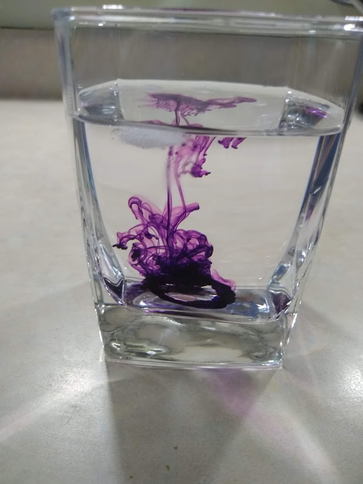
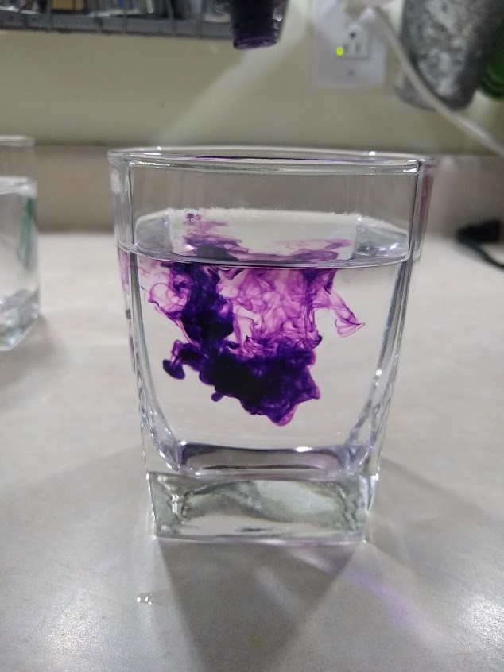

# Food Dye Experiment

This experiment shows the difference in how food dye acts when in cold water and hot water.  

## Goal
Make science fun!
Learn about the difference in cold water and hot water, and why!

| Cold Water with Food Dye |
|:------: |
|  |

| Hot Water with Food Dye|
|:------: |
| |

## Materials

* Food dye (any color)
* Hot and cold water
*  2 Jars or containers

## Time

***Total:*** 20 minutes
* Set up: 5 minutes
* Clean up: 5 minutes

## Lesson
Steps for making your experiment!
 1. Gather your ingredients
 2. Add the hot water and cold water into their separate jars
 3. Add a few drops of food dye to each jar with water (add the food dye at the same time or one after another, quickly)
 4. Record what happened to the food dye in the water

Clean up!
 1. Dump out the water and wash out the food dye

## Level of effort

Easy! Just adding food dye to water and recording the results!

## Clean up: Level of effort

Once again easy!

## Pointers

Use a food color that you can easily see in the water.
* Point out the that hot water has more thermal energy.  We can see this energy by watching how the dye gets **mixed** into the water.  More energy the faster the molecules "move" causing the dye to get mixed faster.

## References
