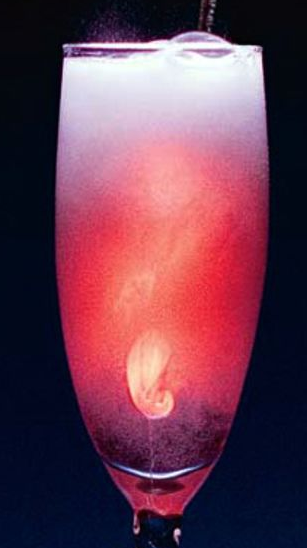

# Glow Water
This sounded AWESOME: Physics and Chemistry combined.  Nifty visible proof in why we need physics and why we need quantum mechanics.

Two chemicals create a glowing mixture that’s a window
into the weird world of quantum physics ( [QuantumPhysicsInGlass](https://www.popsci.com/diy/article/2008-07/quantum-physics-glass))

## Why this experiment is a  NO go.
First you need TOXIC or produce TOXIC chlorine gas!

Do we really need a second NO? TOXIC chlorine gas should be a hard enough full stop for anyone.

Second, you need really really strong hydrogen peroxide.  Second hard stop.

Lastly, it is really short.

So LOTS and LOTS of danger with no pay or very little pay off.  Best thing to do is watch the video and say "COOL."  Then, go to graduate school in chemistry or physics and try it there.

## Why I was tempted: Explanation of Experiment
(Adapted From Popular Science by Mike Walker)
Before the discovery in the 1920s of quantum mechanics—laws that explain the way the world works on the very small scale of atoms and electrons—the fact that bleach and peroxide glow when mixed would have seemed like just another chemical reaction that gives off light, like fire or fireflies. But it is a glimpse into QUANTUM MECHANICS!!!

***Known:***

    Hydrogen peroxide (H2O2) decomposes when it meets chlorine,
    releasing molecules of oxygen, each of which has one electron
    in a high-energy state.

***Old Theory:***

    When the electrons inevitably return to a low-energy state,
    the excess energy comes off as a photon of light, creating a glow.

***There are two problems with this Theory***

* First, quantum calculations show that the energy created in this transition is only enough for a photon of infrared light, which is invisible.

* Second, there are three separate laws of quantum mechanics that say this particular transition (a lone oxygen molecule going from high to low energy) can't happen anyway.

### Why, the light:
Since the transition is forbidden, the molecule is stuck in its "excited" state—until, that is, it eventually collides with another excited molecule, breaking one of those laws (symmetry) and allowing two electrons to return to lower-energy states simultaneously. Together they release a single photon with twice the energy: a photon of visible orange-red light.

## References
* [Quantum Physics in a Glass](https://www.popsci.com/diy/article/2008-07/quantum-physics-glass)
* [Glow water video](https://science.wonderhowto.com/how-to/make-chemiluminescent-reaction-with-home-chemicals-273260/)
