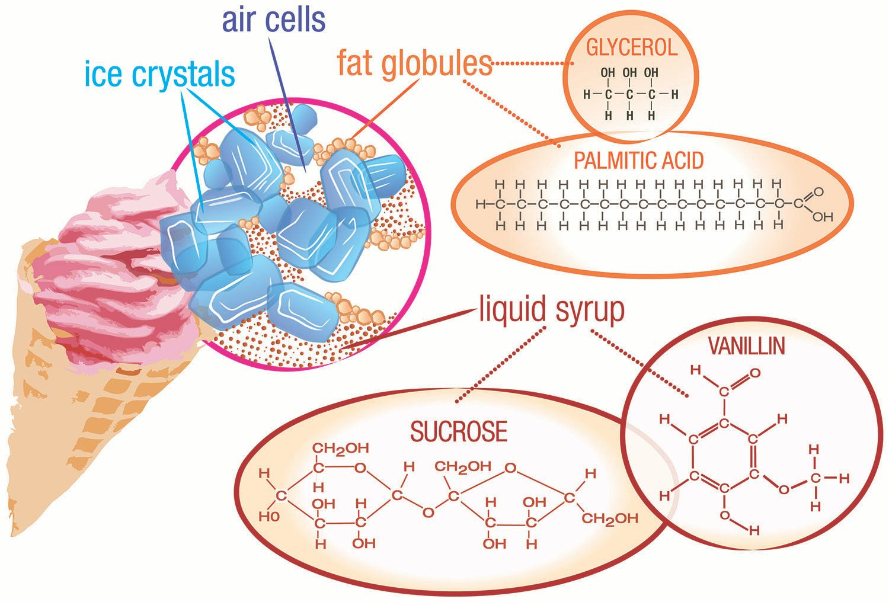

# Dry Ice Ice Cream:  

Dry ice ice cream is a quick easy way to make Ice Cream. and learn a little food science.  Bonus, the ice cream can become carbonated with this method too.

Did you know that: *Air makes up anywhere from 30% to 50% of the total volume of ice cream.*  Guess that is why one can make Ice Cream Floats!

## Goal
Cooking is science too!  

Food science is an area one can apply science to make the food we eat taste better, be better for the environment, and make safer to eat.

Here we learn about Emulsions! An Emulsion is the combination of two liquids that don't normally mix together.

## Materials

- [ ] 1 your favorite ice cream base (cooled).  
    - Mine is [Jeni's Ice crean base](https://www.saveur.com/article/Recipes/Jenis-Ice-Cream-Base)
- [ ] 1.2 lbs of dry ice
- [ ] Warm gloves (Ice is COLD)
- [ ] Mixing bowl
- [ ] Hammer or mortar and pestle  

Servings: 1 serving

## Instructions

* Added the ice cream base to a mixing bowl
   * Stand mixer is ideal.
* Smash the dry ice.  
   * NOTE: if using a stand mixer, you want the dry ice to be about rice size.  Large chunks will cause the ice cream to fly out and over everything in your kitchen with the ice cream base.  
* Add about 1/2 of the dry ice in.	 
* Start mixing! Slowly at first.
* After 5 min. check to see if you need to add more dry ice.

## Time
20 min.

## Lesson
Ice cream is an emulsion! Am emulsion is a combination of two liquids that don't normally mix together.

In ice cream, liquid particles of fat (fat globules) are spread throughout a mixture of water, sugar, and ice, along with air bubbles (see figure above). Ice cream is porous (has holes). A typical air pocket in ice cream will be about one-tenth of a millimeter across. The presence of air means that ice cream is also a **foam**. Other examples of foams are whipped cream, marshmallows, and meringue (as in lemon meringue pie).  The air pockets allow ice cream to float in that root beer float.

The most common ingredients in ice cream include ice crystals, air, fat globules, sugar (sucrose), and flavoring agents (such as vanilla).

### Fat: Doesn't mix well

Main reason ice cream tastes great is because of its high fat content. Ice cream must contain at least 10% fat, and this fat must come from milk. (You cannot use lard when making ice cream!)

Premium ice creams may have up to 20% fat, which gives it a velvety, rich texture. Reduced fat ice cream does not taste as good as the real thing, and tends to lack the creamy texture.
The problem with using fat as an ingredient in any food is that it doesn’t mix well with a lot of other substances.

*  **Fat** is **nonpolar**, meaning positive and negative charges within the fat molecule are equally dispersed.
* Water is **polar**.  A polar substance has separate regions of positive and negative charge—one end of a polar molecule has a partial positive charge, and the other end has a partial negative charge.

Polar and nonpolar substances do not mix. Just like oil floats to the top of water, the fat content in ice cream has a tendency to separate out, as well.

## Ice Cream: An Emulsion:
* OK: Ice cream is an mixture, but the fat in the mixture doesn't separate after some time. For example Salad Dressing, when you shake up a bottle of salad dressing, the two parts combine.  But after a few minutes, they begin to separate.
* Reason: Salad Dressing is a coalescence.  The oil droplets interact with one another!  And Ice Cream is an Emulsion.

#### Why:
In milk, each fat droplet is coated with a layer of milk proteins that prevents the fat droplets from interacting with one another. These milk proteins act as “emulsifiers” (substances that stabilize emulsions) and allows the liquid droplets present in the emulsion to remain dispersed, instead of clumping together. Because these milk proteins have a nonpolar side, and because "like dissolves like", the nonpolar sides of the proteins are attracted to the nonpolar fat globules. This is good in milk, but not so good in ice cream, in which the fat droplets should coalesce to trap air.

So another emulsifier is added to allow the fat droplets to coalesce. This emulsifier replaces milk proteins on the surface of the fat droplets, leading to a thinner membrane, which is more likely to coalesce during whipping. A common emulsifier is lecithin, found in egg yolks. Lecithin is a generic term that refers to a group of molecules that consist of long chains of fatty acids linked to a glycerol molecule, along with choline and a phosphate group.

Lecithin inserts itself between the fat globules, which helps the fat globules to clump together and, as a result, the air bubbles that are present in the mix are trapped by this partially coalesced fat. This adds firmness and texture to the ice cream, enabling it to retain its shape.

Closely related to emulsifiers are stabilizers, which make the texture creamy. Stabilizers have two roles: First, they prevent large crystal formation. In the presence of stabilizers, ice cream contains small ice crystals that are easier to disperse and, therefore, they melt more slowly than larger ice crystals would. Second, emulsifiers act like a sponge by absorbing and then locking into place, any liquid in the ice cream.

Common stabilizers are proteins such as gelatin and egg whites. Guar gum, locust bean gum, and xanthan gum can also be used. Carrageenan and sodium alginate are derived from seaweed! Without these stabilizers, ice cream might look like a milkshake.

### Cold Effects Taste!

Milk naturally contains lactose, or milk sugar, which is not very sweet. Because cold tends to numb the taste buds (making them less sensitive), more sugar needs to be added to make the ice cream taste sweet. If you taste ice cream at room temperature it will taste overly sweet. The same effect happens with carbonated soft drinks. If consumed warm, they taste sickly sweet. In parts of the world where soft drinks are normally consumed warm, there is less added sugar.

#### Freezing the Cream!
Once you get all of the ingredients together in a mixture, you need to freeze the mixture to form ice cream. The dissolved solutes (mostly sugar) in the liquid portion of the mixture lower its freezing point. A freezing point depression of 1.86 °C occurs for every mole of solute added to 1 kilogram (kg) of water. In other words, if you dissolve one mole of sugar in 1 kg of water, water will no longer freeze at 0 °C, but rather will freeze at –1.86 °C.

A typical batch of ice cream will freeze at -3 °C (27 °F), due to the presence of all the dissolved solutes.

* Ice Cream is cold!

## Level of effort
* Easy

## Clean up: Level of effort
Low
## Pointers
* Smash the dry ice into small pieces before turning the mixture on.
* Make sure all of the dry ice has melted **BEFORE** eatting the ice cream.

## Brain Freeze:
When ice cream touches the roof of your mouth, it may trigger a cold headache. The cause is a dilation of blood vessels in your head located above the roof of your mouth. When this nerve center gets cold, it seems to overreact and tries to heat your brain.

## References
* American Chemical Society: [Ice Cream Chemistry](https://www.acs.org/content/acs/en/education/resources/highschool/chemmatters/past-issues/archive-2013-2014/ice-cream-chemistry.html)
