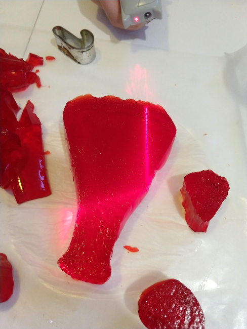
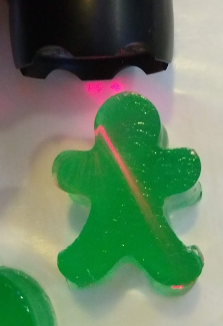
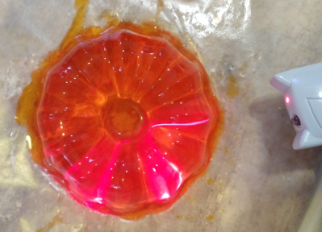

# Lasers and Jello
Not quite Sharks With Lasers.  
However, jello makes an excellent medium that kids can use to design and
create lenses to explore properties of light.

|  |  |
|:--|:--|
| Internal Refraction | Angle change |

## In honor of Dr. Donna Strickland
2018 Nobel prize winner in Physics for creating the technique of Chirped Pulse Amplification(CPA) for lasers, where a laser is pulsed over a short time to increase it's power!  

## Objective
Explore properties of lenses and light

## Material
- Jello: 5 packages
* Plain gelatin
- Lasers
- Cookie cutters (optional)
- Disposable table cloth  (optional)

### Challenge Materials (Optional)
- Bulls eye
- Cookie sheet to contain the challenge experiment
- Masking tape

## Difficulty
Easy and safe

## Mess Factor
High.  Disposable table cloth should be used since you will get Jello everywhere.

## Pointers
Do add a challenge, otherwise this becomes pure play. Which is not bad, but if you want them to learn more then a challenge is needed.

* Make the jello thick like Jello jigglers.  The jello needs to be able to stand up on its own.  
   * One packet of Jello with one packet of plain gelatin works well.
* Set the jello on a cookie sheet. Easier to cut into lenses
* Make lots of jello.  More than you think you need.  

## Challenge
RULEs:
* Laser starts at the starting point
* Laser must hit the end point
* Use any shape of Jello
* Laser must stay within the cookie sheet
* You can only use the Jello to bend the light.

### Bend light 90 degrees and hit a target
* Place the masking tape on one side of the cookie sheet to indicate the start point.
* Place another piece of tape on a another side to indicate the goal.

### Bend light 180 degrees and hit a target.

