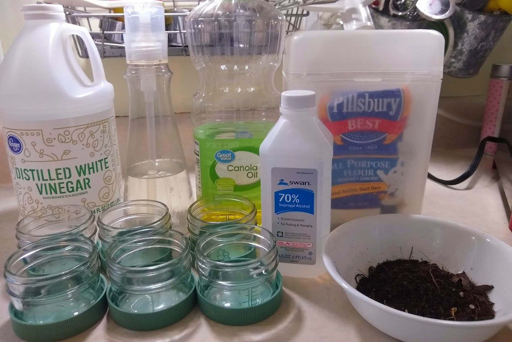

# Different Materials in Water

This experiment is about finding the difference in materials, when the mix into water.  You will see some materials make solutions and others mixtures.

## Goal

Make science fun!
Learn how different materials mix into water!

## Materials

1. Clear Vinegar
2. Rubbing Alcohol
3. Liquid Soap
4. Flour
5. Dirt
6. Oil, Vegetable
7. water (the warm/room temperature)
8. 6 jars with lids

## Time

- ***Total:*** 40 minutes
   - Set up: 10/15 minutes
   - Clean up: 15/20 minutes

## Lesson

Steps to complete experiment!
1. Gather all of your materials (this may take longer than the other experiments)
2. Pour your warm or room temperature water into each of your jars
3. Add the first material (Clear vinegar) ***Shake and record!***
4. Set the first jar aside, and add the second material (Rubbing Alcohol) to the second. Once again shake and record!
5. Repeat with the third, fourth, fifth, sixth, seventh and eighth materials!

## Level of effort

Medium, the experiment its self is easy, but finding some materials may take some time.

## Clean up: Level of effort

Easy, (as long as you know where every thing goes, once you are done).

## Pointers

Record what happened to each material as you are doing the experiment, not after.
Make sure the water stays the same temperature throughout the whole experiment.

## References
