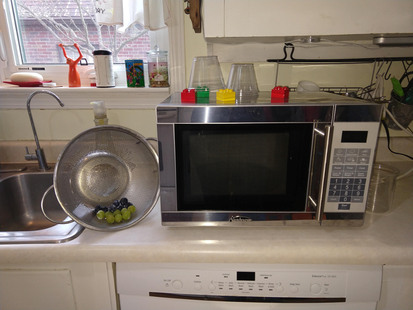
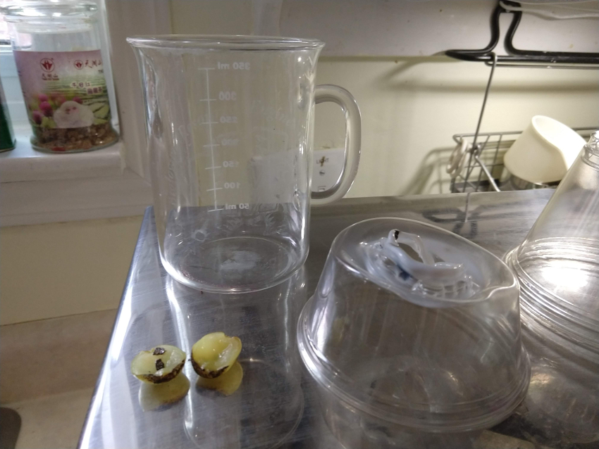

# Plasma with Grapes
 WARNING: THIS MAY DESTROY YOUR MICROWAVE
 

 |  |
 |:--|
 |  |
## Goal
Show that plasma is a state of matter that can be made at home, just like you can do with the other (main) three: Solid, Liquid and Gas.

Demystify this fourth state of mater.

Show that science is fun.

## Materials
* Microwave you do not care about
* Grapes
* Knife
* paper towels
* Clear container (too protect the microwave and capture the plasma)
   * glass beaker worked well
* Plastic spacers (Legos, lids etc.) To lift the container off the ground.

## Time
* 15 minutes

## Instructions
WARNING: Your microwave might get destroyed

### The simple process:

* Cut a single grape nearly in half, leaving a bit of skin connecting the two halves,
* Then microwave it by itself.

After a few seconds, you'll see sparking and a plume of plasma — a stream of charged particles called ions — leaping from one half to the other, then rising upward.

### The bit more complicated process:
* Cut the grapes completely in half.
* Squeeze out the extra juice (e.g flatten it on a paper towel)
* Place two halves in the microwave with a little bit of over lap.
* Place plastic spacers around the grape
* Place the clear disposable plastic cup over the grape but resting on the spacers
* Turn the microwave on.

The plastic cup will capture the plasma so you can see it longer and hopefully protect the microwave.  It will melt the plastic cup.

## Lesson

### Plasma
Plasma is often called “the fourth state of matter,” along with solid, liquid and gas. Just as a liquid will boil, changing into a gas when energy is added, heating a gas will form a plasma – a soup of positively charged particles (ions) and negatively charged particles (electrons).

Plasma is **superheated** matter – so hot that the electrons are ripped away from the atoms forming an ionized gas. It comprises over 99% of the visible universe. In the night sky, plasma glows in the form of stars, nebulas, and even the auroras that sometimes ripple above the north and south poles. That branch of lightning that cracks the sky is plasma, so are the neon signs along our city streets. And so is our sun, the star that makes life on earth possible.

Because so much of the universe is made of plasma, its behavior and properties are of intense interest to scientists in many disciplines. Importantly, at the temperatures required for the goal of practical fusion energy, all matter is in the form of plasma. Researchers have used the properties of plasma as a charged gas to confine it with magnetic fields and to heat it to temperatures hotter than the core of the sun.

### Common Plasmas:

| Man Made | On Earth Plasmas | Space Plasmas |
|:---       |:---              |:-----          |
| Plasma TV Displays | lightning  | Stars  |
| Neon Signs  | magnetosphere  | Solar Wind  |
| Static Electric sparks |  St. Elmo's Fire  | Interstellar Nebulae |

### The Experiment

How it works: microwaves normally cook food by sending microwave radiation through it, which agitates the water molecules, causing them to vibrate and generate heat.

But in this case, since there's not enough food in the oven to absorb these microwaves, they become so concentrated in the grape tissue that they rip some of the molecules apart, generating charged ions. There are also some ions already present in the grapes — electrolytes.

Due to the size of the grapes  (~1 cm) and the frequency of the concentrated microwaves (~ 1cm), an electromagnetic (EM) field forms, causing these ions to flow from one grape half to the other. Initially, they pass through the flap of skin, but eventually, they leap through the air. This causes some of the surrounding air to ionize as well — producing the extremely hot, bright plumes of plasma that will rise upward in the microwave.

**This plasma can damage the microwave**, and running it empty (or in this case, nearly empty) isn't a good idea in general, as the un-absorbed radiation can damage it as well.

## Level of effort
* Easy

## Clean up: Level of effort
* Easy
* **WARNING: THIS MAY DESTROY YOUR MICROWAVE!!**

## Pointers
* Use a clear disposable plastic container over the grape to keep the plasma contained.  This is melt the container and hopefully protect the microwave.
* Squeeze out the extra juice in the grape.  The water add extra thermal mass (thus slowing it from heating up)
* Use a glass beaker, the plastic melts really easily

## References
* Plasma Science and Fusion Center (MIT): [What is a Plasma](http://www.psfc.mit.edu/vision/what_is_plasma)
* How to Make Plasma in your Microwave using a grape: [Ice Cream Chemistry](https://www.vox.com/xpress/2014/12/3/7326643/grape-plasma-microwave)
* Wikipedia: [Plasma Physics](https://en.wikipedia.org/wiki/Plasma_(physics))
