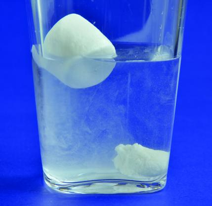

# How to Sink a Marshmallow  
Adapted from [How Things Work: How To Sink A Marshmallow](https://www.parenting.com/gallery/easy-science-fair-projects/)
### The purpose of this project is to find out whether or not the marshmallow sinks with the ingredients added.
Time: 5 to 10 minutes   
Skill Level: Medium   
The experiment: Marshmallows are filled with air, which makes them float.

## Materials:
* Mini marshmallows
* Large clear bowl of water
* Cornstarch
* Flat surface, such as a cutting board, tabletop or counter
* Spoon (optional )

## What to do:
1. Drop a marshmallow into the water. Does it sink or float?  
2. Sprinkle cornstarch over your flat surface.
3. Put the marshmallow on the cornstarch and squash it. Try rolling it, smashing it down or smashing it between your hands. The cornstarch will keep it from getting too sticky.
4.Put it in water to see if it floats. (If it sticks to your hands, scrape it off with the spoon.)
5 The more you squash the marshmallow, the lower it will float in the water. If you squash it small enough, it will sink.
6. If your marshmallow didn’t sink, grab another one and try again!

# What’s happening:
When you squash the marshmallow, you make it smaller and denser. The smaller it is, the less water it can push aside, and the lower it floats. If you squash the marshmallow so small that it’s denser than water, it will sink.

# More fun:
Can’t sink your marshmallow? Pour a cup of cooking oil, such as vegetable oil, into a bowl, and drop in your marshmallow. Since the oil is less dense than water, the marshmallow is more likely to sink.
