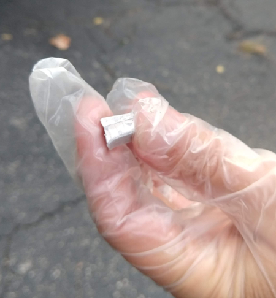

# Sodium

## Objective
Give kids first hand experience with chemical properties.

Let them see how those properties change significantly when a molecule is formed.  

## Talking Points
Salt is made up of two elements: Sodium and Chlorine.
* Our body needs salt to live.
* Our body is also made up of mostly water
* Sodium gets really, really hot in water!
* Both Sodium and Chlorine are less dense than water, but salt is more dense.

### Physical properties:
Salt:
* Clear crystal.
* Hard
* Dissolves in water, no heat
* Does not change the PH of water
* Density (~ 2.15 g/cc): Denser than water.

Sodium:
* Shinny metal
* Bendable: show how easy it is to cut
* Reacts in water
* Gets really, really hot in water
   * try to catch a stick on fire when you put a little bit of sodium in water
* Less dense (~0.98g/cc) than Water
* Changes when dissolved in water the PH.  Makes a base called sodium hydroxide

## Materials
- Salt: NaCl
- Sodium: Na
- Water: H2O
- Large bucket
- Gloves
- Safety glasses
- Optional: Salt and Sodium Compare
   - 2 small Pyrex glasses filled with  Water
   - 3 PH Testing stripes
   - table spoon of Salt
   - ~ 1 cc of sodium (about tablespoons size)
   - Thermometer
   - Stirring spoon

## Difficulty
Surprisingly easy to get sodium.

***Danger level: High***

READ Sodium's [msds sheet](../doc/msds_sodium.pdf)

## Salt and Sodium compare:
Make sure you use heat proof glassware like Pyrex.

In this comparison,  we are going to look at several physical properties of salt and sodium: Density, exothermic reaction, and PH.  First observe these properties with salt and then do the same with the sodium.

### Steps:
#### Step 1: The Control (Water)
BEFORE adding anything:
* Measure the temperature of the plain water
* Measure the PH (it should be ~7)
Ideally you should write this down.

#### Step 2: Salt and  water
* Added the 1 tablespoons of salt to ONE of the pyrex container with water.
* Note: how the salt sinks to the bottom because it is MORE dense than water.
* Stir the salt until dissolved or mostly dissolved
* Measure the PH (It shouldn't change the PH)
* Measure the temperature (It shouldn't change too)

#### Step 3: Sodium and water
With Safety glasses and gloves ON.
* Add 1 teaspoon of sodium metal in the Water
* Watch it float
* Watch it react to the water and release lots of Hydrogen.
* After the Sodium finishes reacting
   * Measure the Temperature (Did it change?)  It might not change that much since we are using only a little bit.
   * Measure the PH: This should change to produce a strong base.

### PH:
PH is a scale used to quantify how basic or acidic a solution is.  Water is neutral with a ph of 7.  

PH:
* 7 neutral
* \> 7 basic (Baking soda 9.5)
* < 7 acid (Lemon Juice ~ 2)

### Density:
Salt (though Cl and Na by themselves are less dense) is twice as dense as water.  When salt is first added to the water it will sink because it is denser.  Sodium is less dense than water so it will **float**, (while it lasts!).

### Temperature:
When sodium is added to the water, the sodium reacts in an exothermic reaction (It produces a lot of heat.)

## Pointers
Use ONLY a little bit of sodium at a time.  Dime size.

***Danger level: High***

Make sure everyone is wearing safety glasses

***DO NOT TOUCH*** the sodium when it is in the water.  It gets really really hot?  You will burn yourself.

## References
* [PH Defined](https://en.wikipedia.org/wiki/PH)
* [Sodium msds sheet](../doc/msds_sodium.pdf)
