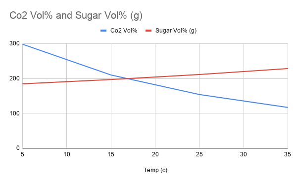

# Sugar Solubility

This is an experiment about the saturation point of solids in liquids (specifically water and sugar). This is in contrast to gases in liquids. [Co2 Solubility](Co2Solubility.md)

## Goal
To learn how solubility of solids changes as a function of temperature.
Make science fun with a ***sweet*** experiment.

## Materials

- [ ] Granulated Sugar
- [ ] 3 jars with lids (preferably glass jars)
- [ ] Teaspoon
- [ ] Thermometer (ex: instant read thermometer)
- [ ] A piece of paper (to record your results)
- [ ] Cold, warm, and hot water

## Time

It took me about an hour, which includes set up and clean up. If you are doing this at home plan for an hour-long activity.

* Total Time: 1 hour
  * Set Up: 10 minutes
  * Clean up: 20 minutes

## Lesson

Steps:
  (Make sure to write down how many teaspoons of sugar you add to the water.)
1. Gather your materials
2. Take the jar of cold water and measure the temperature. ***(Write this down on your paper)***
3. Add 1 teaspoon of sugar.
4. Shake the same jar until the sugar is dissolved.
5. Add another teaspoon of sugar and shake .
6. Repeat step 4 until you can't dissolve the sugar into the water anymore and record you results.
7. Take the jar of warm water and measure the temperature. ***(Again, write this down)***
8. Add 1 teaspoon of sugar at a time, while shaking until dissolved in between each teaspoon.
9. Once you can't dissolve any more sugar into the water, record the amount of teaspoons you could dissolve into the water.
10. Repeat with the hot water. (Steps 7-9)

## Level of effort

Easy

## Clean up: Level of effort

Even though the clean up took 20 minutes, I would still say it was an easy clean up. The hardest part was washing the sugar out of the jars.

## Pointers

* You could probably do both the Sugar and CO2 together within an hour

## WARNING

Do not use boiling water since you can burn yourself.  Use very cold and Hot to touch water.

## References

- [Sugar Solubility Data ](https://chestofbooks.com/food/science/Experimental-Cookery/The-Solubility-Of-The-Sugars.html#:~:text=Sucrose%20has%20the%20greatest%20solubility,are%20soluble%20in%201%20cc.)
- [Co2 Solubility Data ](https://www.researchgate.net/figure/Solubility-of-CO2-in-distilled-water-in-ppm-as-a-function-of-temperature-and-the_tbl1_226545649)
