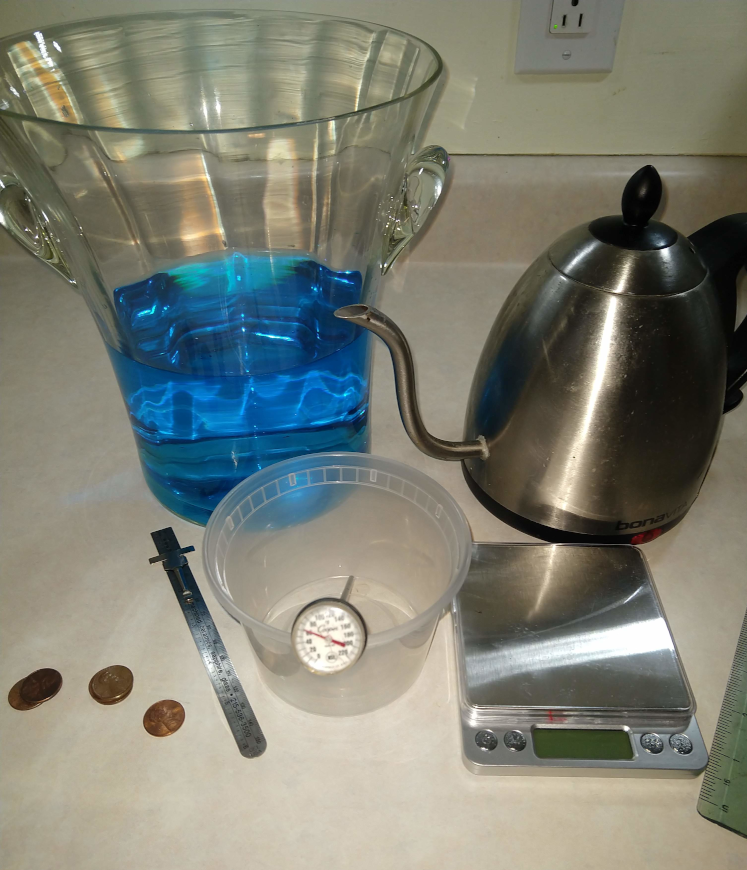

# Water's Density

Measuring Water's density as a function of temperature

## Goal

Learn that the density is dependent on the temperature and that even small changes of density is measurable.  The difference in the density of hot and cold water is in the hundred's place.  This seems small.  But when you use pennies as your mass that goes into your "boat", you can see how that is significant since the cold water will hold several more pennies than the hot water.

### Bonus

You can have the students predict the penny difference the hot and cold water holds by calculating the density in units of pennies/cm3.

## Materials

- [ ] Scale
- [ ] Two hundred pennies
- [ ] Thermometer
- [ ] Small plastic container: wide and shallow
- [ ] Ruler
- [ ] Bucket  or sink
- [ ] Very Hot Water
- [ ] Very Ice Cold Water

## Time

* Prep: 20 min
* Lesson: 40 min
If you have pennies in stacks of 10 high makes counting faster

## Lesson

Water Density as function of temperature.

| Temp (C) | Temp (F) | Density (g/cm3)|
|:--------:|:--------:|:--------:      |
| 4        | 39.2   | 1.000 |
| 20       | 68     | 0.9982 |
| 40       | 104    | 0.9922 |
| 60       | 140    | 0.9832 |
| 80       | 176    | 0.9718 |

Density is the ratio of an objects mass divided by it's volume.
* d = m/v

We can measure the density of water indirectly by seeing how many pennies will float
(see [Aluminum Boats lesson](AluminumBoats.md)).  

If you want to take this lesson up another notch, as the students to *predict* how many more
pennies the cold water holds vs. the hot water.

### Steps

- [ ] Measure the weight of 5 pennies.
   * to get grams per penny take weight/5

Cold Water Density Measurement
- [ ] Fill bucket or sink with cold water (add ice cubes to make it very cold)
- [ ] Measure and record the temperature
- [ ] Carefully place *boat* into the water
- [ ] Slowly add pennies until the boat sinks
- [ ] Record number of pennies was in the boat

Hot Water Density Measurement
- [ ] Same as cold but use HOT water
- [ ] **WAIT** until water has cooled down before retrieving pennies or moving bucket

Density Calculation
- [ ] Calculate density:
   * Take number of pennies / volume of container
   * Convert pennies to grams and then recalculate density.  Compare with chart above

### NOTES:
You want to measure the weight of 5 pennies to reduce error in teh weight measurement and to increase the sensitivity the scale.  If you scale is only accurate to a 10th gram, by measuring 5 pennies you are getting the weight of ONE penny to the accuracy of 50th of a gram (5 x better precision).

### Example:
Weight of 5 pennies is 13.4g
Therefor weight of 1 penny is 2.68 (See higher precision than the scale!)
Volume = 383 cm3

If volume is the same and only the temperature changes from 20 to 80 degrees (c) and the boat barely floats.  
How many pennies would need to be removed to ensure the boat floats.
* Number of pennies 20 (c) holds
   * d*v = mass
   * mass / 2.68 = # of pennies
   * Number of pennies = 0.9982 (g/cm3) * 383 (cm3)  / 2.68 = 142.6 pennies
* Number of pennies at 80 (c) holds
  * Number of pennies = 0.9718 (g/cm3) * 383 (cm3)  / 2.68 = 138.88 pennies
  * 4 penny difference!

#### Example Student Chart

| Water Temp (F) | Actual Density (g/cm3) | Number of Pennies held | Predicted Density (g/cm3)|
| :-------| :-------| :-------| :-------|
| 60 F       |  0.999  | 142  pennies | .9936  |
| 140 F      | 0.983   | 140  pennies | 0.980 |     

## Level of effort
Doing the experiment is Elementary to Middle school level.
* Easy to do the experiment and SEE the density changes.

Density Calculation: Middle school level
* Easy: Calculating the Density of the hot water and the cold water straight forward: D=m/v  e.g. sum of the weight of the pennies / volume of container

* Can be hard the penny prediction. E.G. Knowing the density for hot and cold water predict how many more/less pennies the hot water will hold.
   * Calculate Volume of your container
   * Calculate the total weight.
   * Calculate the Density
   * Calculate the density difference and relate it to pennies.

## Clean up: Level of effort
Easy.

## Pointers
* Make sure to place pennies gently and spread out
* You want to measure the weight of 5 pennies to reduce error in teh weight measurement and to increase the sensitivity the scale.  If you scale is only accurate to a 10th gram, by measuring 5 pennies you are getting the weight of ONE penny to the accuracy of 50th of a gram (5 x better precision).
*  **WAIT** until water has cooled down before retrieving pennies or moving bucket

## Warning:
Hot water is HOT.  Please use care when handling hot water.  It can burn you!

## References
* [Water Density Table](https://www.simetric.co.uk/si_water.htm)
