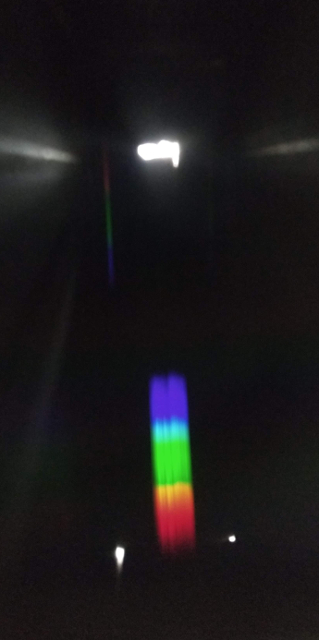
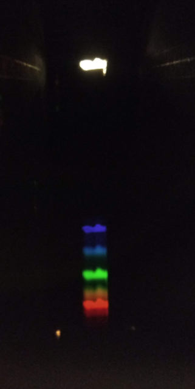
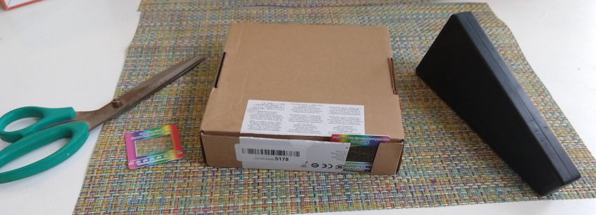
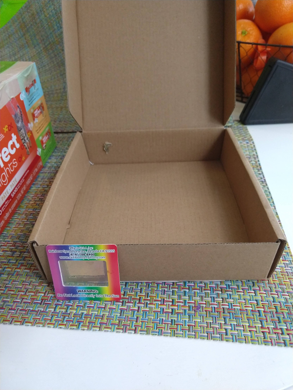
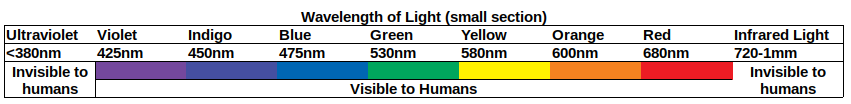

# Measuring Light
Before the periodic table was made and ~ 30 years before it was found on Earth, scientist predicted that Helium must exist by looking at the light the sum emitted!  When matter is heated it emits a unique signatures of light.  This light spectrum is related to its atomic structure.  One can use prisms and diffraction gratings (old CD can also be used for this) to split light into it's individual wavelengths.  

Here were explore the differences between LED, Halogen, lights.  (FYI: splitting light into it's individual wavelengths is used all the time for fiber optic communication.  Each (say TV) channel is on it's own color of light).

Like the Helium discovery, sometimes you can not measure a substance's, weight, volume, hardness to determine what it is.  When you can't get those measurements, scientist can turn to light to determine what a substance is even if they have never seen it on earth!

You can also use this to see the difference between florescent light bulbs and LEDs.

## Goal
Make a spectroscope to see different color of light.

|  |  |
|:--|:--|
| Full Spectrum Light| Florescent Light |

## Materials

* Box or Oatmeal Box
* Diffraction Grating (~$12 or a package of 10)
* Scissors
* Tape
* Different types of lights (LED, florescent, Multi colored)

or purchase a spectroscope for ~ 8 dollars.

|  |
|:--|
|  |
| A spectroscope innards |

### Cost ~ $3.00- 14.00
* NOTE: You can do this cheaper with a CD though you will not be able to measure the wavelengths ( see references)

## Time

25 min ( to make and play with the spectroscopes)

Longer if you talk about how it works and try to calculate

## Lesson

Light is part of the electromagnetic spectrum that we can see (400nm to 750nm).  
White light is made up of multiple wavelengths that are combined.  

Using a prism or diffraction grading we can split up the white light into its individual wavelengths.

You can use this principle to identify materials by seeing what colors it is made up when it glows.

### Grating Equation:
sin(&theta;) = m (&lambda;) / d

Where:
* &theta; = angle of the light coming in and hitting the edge
* m  = 1 (first set of light)
* &lambda; = wavelength of the light
* d = grating spacing

#### Or roughly:
y = (&lambda;) L / d

Where:
* y is the spacing from the slit to the wavelength of Interest
* d is grating spacing
* L is the distance between the slit and the grating
* &lambda; is wavelength of the light

## Level of effort
Easy

## Clean up: Level of effort
Easy

## Pointers
When showing the kids how it works, use a cell phone over where you place your eye so that multiple people can see at once.

Students can make and build there own spectroscopes for ~ $1.50 per student.  Free if you use an old CD (see references)

## References
* [Make a spectroscope with a CD](https://www.livescience.com/41548-spectroscopy-science-fair-project.html)
